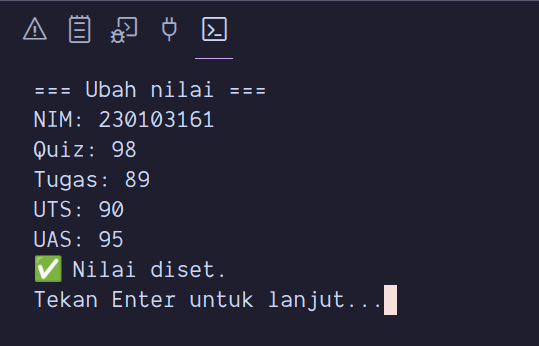
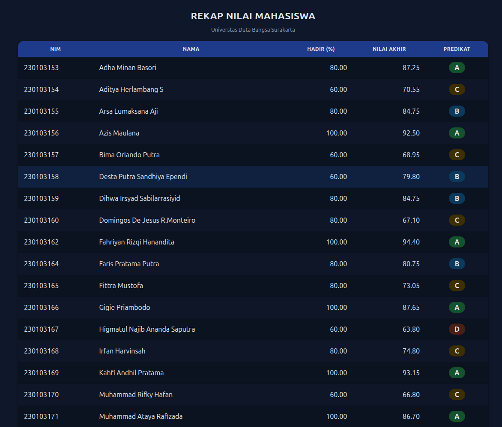
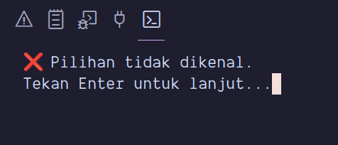

# 🧮 Student Performance Tracker

Repository ini berisi proyek Python berbasis **OOP dan Modularisasi** untuk merekap data kehadiran serta nilai mahasiswa, kemudian menghasilkan laporan dalam format **Markdown** dan **HTML berwarna**.
Program ini dibuat untuk memenuhi tugas **Minggu 9–10 (OOP & Modul–Paket)** pada mata kuliah _Dasar Algoritma Pemrograman_ di **Universitas Duta Bangsa Surakarta**.

---

## 🎯 Tujuan Pembelajaran

- Memahami penerapan konsep **OOP (Class, Object, Property, Method)**.
- Menerapkan **enkapsulasi** dengan `@property` untuk validasi nilai.
- Mengelola data menggunakan struktur **modular (paket & submodul)**.
- Menghasilkan laporan otomatis dalam format Markdown dan HTML.
- Mengenal pengelolaan proyek Python profesional menggunakan `venv` dan `__main__.py`.

---

## 🧩 Deskripsi Program

Program ini berfungsi untuk membaca data presensi dan nilai mahasiswa dari file CSV, kemudian menampilkan dan menyimpan hasil rekap dalam bentuk tabel yang rapi.

## 🧭 Pratinjau Antarmuka (Screenshots)

1. **`Mahasiswa`**
   Mewakili entitas mahasiswa dengan atribut `nim`, `nama`, dan `hadir_persen`.
   Terdapat validasi agar persentase hadir berada pada rentang **0–100**.

2. **`Penilaian`**
   Menyimpan nilai **quiz**, **tugas**, **UTS**, dan **UAS**.
   Memiliki metode `nilai_akhir()` untuk menghitung skor akhir berdasarkan bobot 15–25–25–35.

3. **`RekapKelas`**
   Menggabungkan data `Mahasiswa` dan `Penilaian` menjadi satu rekap.
   Dapat menampilkan nilai akhir, predikat huruf (A–E), serta melakukan filter mahasiswa dengan nilai <70.

4. **`Report`**
   Menghasilkan file laporan:

   - `report.md` → tabel Markdown
   - `report.html` → tabel berwarna sesuai predikat

---

## ⚙️ Fitur Program

- ✅ **Rekap otomatis dari file CSV (`data/attendance.csv` dan `data/grades.csv`)**
- ✅ **Menu interaktif CLI (1–9)**
- ✅ **Filter mahasiswa dengan nilai <70 (remedial)**
- ✅ **Ekspor laporan ke Markdown dan HTML berwarna**
- ✅ **Dapat dijalankan sebagai paket dengan `python3 -m tracker`**

---

## 📁 Struktur Folder

```
STUDENT-PERFORMANCE-TRACKER/
├─ data/
│ ├─ attendance.csv
│ └─ grades.csv
├─ Image/
├─ out/
│ ├─ report.html
│ ├─ report.md
│ └─ report_mod.md
├─ tracker/
│ ├─ init.py
│ ├─ main.py
│ ├─ mahasiswa.py
│ ├─ penilaian.py
│ ├─ rekap_kelas.py
│ └─ report.py
├─ venv/
├─ app.py
└─ README.md
```

---

## 🧠 Cara Menjalankan

### 1️⃣ Aktifkan Virtual Environment (opsional)

```bash
python3 -m venv .venv
source .venv/bin/activate
```

### 2️⃣ Jalankan aplikasi

```bash
python3 app.py
```

Atau jalankan langsung sebagai modul:

```bash
python3 -m tracker
```

---

## 🧭 Menu CLI

```
1) Muat data dari CSV
2) Tambah mahasiswa
3) Ubah presensi
4) Ubah nilai
5) Lihat rekap
6) Simpan laporan Markdown
7) Filter nilai < 70 (remedial)
8) Simpan laporan HTML berwarna
9) Keluar
```

---

## 🖥️ Contoh Output Program

> Folder: `Image/`

- **Menu Utama**  
  

- **Tambah Mahasiswa**  
  

- **Ubah Presensi**  
  

- **Ubah Nilai**  
  

- **Memuat Data CSV**  
  

- **Filter Nilai**  
  

- **Lihat Rekap**  
  

- **Simpan ke HTML**  
  

- **Simpan Laporan Markdown**  
  

- **Contoh Hasil HTML**  
  
  
  

- **Contoh Validasi/Insiden Error**  
  
  
  
  

---

---

## 💡 Teknologi yang Digunakan

- Python 3.10+
- Object-Oriented Programming (OOP)
- Modularisasi (Paket dan Submodul)
- CSV Handling
- Markdown & HTML Generator
- Virtual Environment (`venv`)

---

## 👨‍💻 Pengembang

**Nama:** Eka Rizki Suwarno
**Kelas:** TI-23A5
**Dosen Pengampu:** Bapak Triyono, S.Kom
**Mata Kuliah:** Dasar Algoritma Pemrograman
**Kampus:** Universitas Duta Bangsa (UDB) – Surakarta

---

## 🧾 Lisensi

Dibuat untuk keperluan akademik (non-komersial).
Semua kode dapat digunakan kembali untuk pembelajaran dengan mencantumkan sumber.
